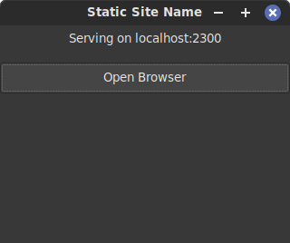

# go-webserver

This program will embed the contents of the src directory into the generated binary and then server it on port 2300 or the next available port if that one is in use. This implementation supports gzip compressed files to both reduce the binary size and reduce the bandwidth used. This binary has a GUI which is nice for distributing manuals and documentation which can then be run and shown in the web browser.

## Requirements
- gtk3 - For the GUI.
- upx - To compress the executable.
- gzip - To compress the contents of the src directory.

## Building
The building process will take a very long time the very first time because it has to compile GTK3 bindings. After the first build it will compile almost instantly depending on the size of the contents of the src directory.

To build the smallest possible binary use compress.sh which will compress the contents of the src directory into gzip compressed files then use upx on the resulting binary.